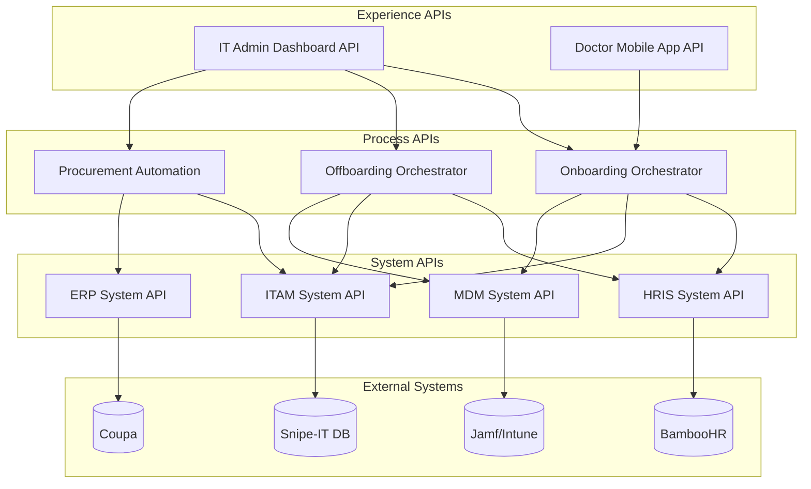
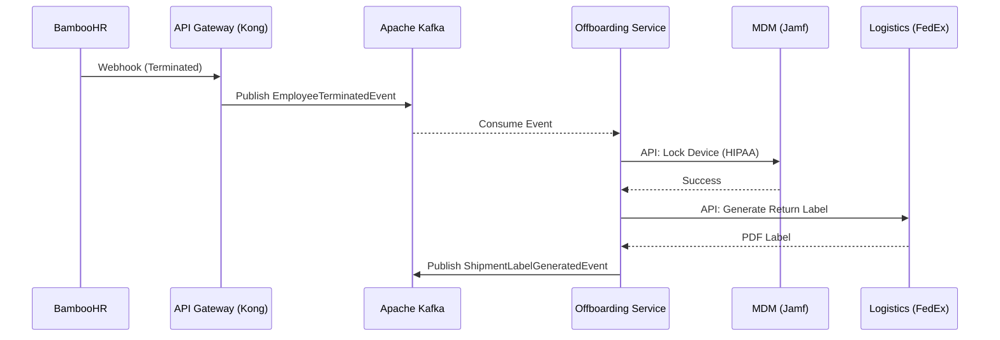

# Deliverable 6: TO-BE Integration Architecture
**Company:** Aegis Health Partners

## 1. API-Led Connectivity
Aegis Health Partners will adopt a three-tiered API-Led Connectivity approach to decouple backend systems from frontend experiences. This ensures reusability, agility, and security across the IT ecosystem.



### System APIs (Core Systems of Record)
Abstracts the complexity of backend systems and exposes data in a standardized RESTful format.
* **HRIS System API:** `/api/v1/hr/employees` - Handles CRUD operations for employee data.
* **ERP System API:** `/api/v1/erp/purchase-orders` - Manages procurement and finance data.
* **MDM System API:** `/api/v1/mdm/devices` - Interacts with device management for lock/wipe and telemetry.
* **Asset System API:** `/api/v1/assets/inventory` - Direct database interactions for ITAM.

### Process APIs (Business Logic & Orchestration)
Orchestrates data from multiple System APIs to implement specific business processes.
* **Onboarding Process API:** Aggregates HR employee data and triggers Asset and MDM provisioning.
* **Offboarding Process API:** Orchestrates MDM device lock, FedEx label generation, and Asset status updates.
* **Procurement Process API:** Monitors asset thresholds and triggers Coupa POs automatically.

### Experience APIs (User Interfaces)
Tailored APIs designed for specific frontend applications.
* **IT Admin Dashboard API:** Aggregated endpoints for the IT Web Portal.
* **Doctor Mobile App API:** Lightweight endpoints for doctors to acknowledge asset receipt and view policies.

---

## 2. Event-Driven Architecture (EDA)
To achieve zero-touch provisioning and handle asynchronous workflows reliably, Aegis utilizes **Apache Kafka** as its event backbone.

### Event Catalog (10 Types)
1. `EmployeeHiredEvent`: Triggered by BambooHR upon contract signing.
2. `EmployeeTerminatedEvent`: Triggered by BambooHR upon resignation/firing.
3. `EmployeeRoleChangedEvent`: Triggered by BambooHR when departments change.
4. `AssetAssignedEvent`: Triggered by Snipe-IT/Process API when a device is deployed.
5. `AssetReturnedEvent`: Triggered by Snipe-IT upon device check-in.
6. `AssetThresholdAlertEvent`: Triggered by Snipe-IT when inventory stock is critically low.
7. `PurchaseOrderCreatedEvent`: Triggered by Coupa when a new order is placed.
8. `ShipmentLabelGeneratedEvent`: Triggered by FedEx API integration.
9. `DeviceTelemetryAnomalyEvent`: Triggered by AI/ML Engine monitoring MDM health data.
10. `DeviceWipedEvent`: Triggered by MDM (Jamf/Intune) confirming a HIPAA-compliant wipe.

### Topic Design
* `hr.employee.events`
* `itam.asset.events`
* `procurement.po.events`
* `logistics.shipment.events`
* `security.mdm.events`

### Event Schema (Example: EmployeeTerminatedEvent)
Events follow the AsyncAPI/JSON Schema standards.
```json
{
  "eventId": "f47ac10b-58cc-4372-a567-0e02b2c3d479",
  "eventType": "EmployeeTerminatedEvent",
  "timestamp": "2026-05-28T14:30:00Z",
  "data": {
    "employeeId": "EMP-9923",
    "department": "Telehealth",
    "terminationDate": "2026-05-30",
    "assetsToReturn": ["LPT-102", "KIT-501"]
  }
}
```

### Event Flow: Zero-Touch Offboarding


---

## 3. External System Integrations
* **HRIS (BambooHR):** Triggers onboarding/offboarding workflows via Webhooks sent to the Kong API Gateway.
* **Procurement & Finance (Coupa):** Synchronous REST API integration to create purchase orders when IT inventory falls below a threshold, eliminating manual purchasing emails.
* **MDM (Jamf/Intune):** Synchronous APIs for issuing remote lock/wipe commands for HIPAA compliance; continuous data streaming via Kafka for device telemetry.
* **Logistics (FedEx):** REST API for generating return shipping labels automatically upon offboarding. The PDF label is emailed directly to the user.
* **Vendor Portals:** Automated warranty claims and parts ordering via vendor-specific B2B APIs.

---

## 4. GraphQL Integration
To optimize frontend data fetching for the IT Admin Dashboard—which requires data from HR, ITAM, and MDM simultaneously—a GraphQL federation layer is implemented using Apollo Federation.

### Schema Design & Resolver Strategy
* **`Employee` Type:** Resolves base data from the HR System API, and extends with an `assignedAssets` field resolved from the ITAM System API.
* **`Asset` Type:** Resolves base data from the ITAM System API, and extends with a `telemetry` field resolved from the MDM System API.
* **Resolvers:** Implemented in Node.js/Apollo Server, mapping GraphQL queries to the respective RESTful System/Process APIs behind the scenes. This prevents over-fetching on mobile networks.

---

## 5. Integration Testing
Ensuring reliable communication across distributed microservices requires a robust testing strategy.

### Contract Testing (Pact)
* **Consumer-Driven Contracts:** Using Pact, the consuming services (e.g., Onboarding Process API) define the expected API responses.
* **Provider Verification:** The provider services (e.g., HR System API) verify against these contracts during CI/CD pipelines to ensure no breaking changes are deployed to production.

### Integration Test Approach
* **Service Virtualization/Mocking:** Using tools like WireMock to simulate external third-party systems (BambooHR, FedEx, Coupa) during staging tests.
* **End-to-End (E2E) Flow Testing:** Automated tests running in a staging environment to validate entire event-driven workflows (e.g., simulating a webhook from HR and verifying a message reaches the Kafka topic and correctly triggers the MDM mock).
