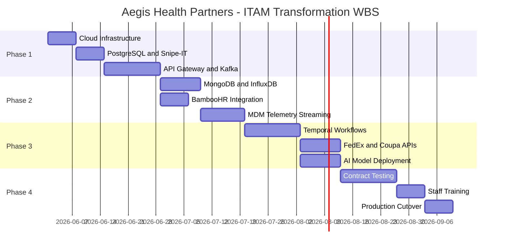

# Deliverable 7: Implementation Roadmap
**Company:** Aegis Health Partners

## 1. Phased Approach
The Aegis Health Partners ITAM transformation will be executed using a **4-phase agile implementation approach** spanning 16 weeks. This ensures incremental value delivery while minimizing disruption to clinical telehealth operations.

* **Phase 1: Foundation & Infrastructure (Weeks 1-4)**
  * *Focus:* Cloud infrastructure setup, base system deployment, and security configuration.
  * *Key Deliverables:* Kubernetes cluster active, Snipe-IT running on PostgreSQL, Kong API Gateway configured, and Apache Kafka cluster running.
* **Phase 2: Integration & Polyglot Persistence (Weeks 5-8)**
  * *Focus:* Deploying secondary databases and integrating the HR system of record.
  * *Key Deliverables:* MongoDB and InfluxDB deployed; BambooHR webhooks firing into Kafka; employee data syncing automatically to Snipe-IT.
* **Phase 3: Automation & AI Rollout (Weeks 9-12)**
  * *Focus:* Workflow orchestration, external vendor APIs, and predictive analytics.
  * *Key Deliverables:* Temporal offboarding workflows active, FedEx (logistics) and Coupa (procurement) APIs integrated, AI predictive maintenance model analyzing MDM data.
* **Phase 4: Testing, Training & Go-Live (Weeks 13-16)**
  * *Focus:* End-to-end validation, user adoption, and system transition.
  * *Key Deliverables:* UAT sign-off, IT Helpdesk trained, GraphQL-powered IT Admin Dashboard deployed, production cutover complete.

---

## 2. Work Breakdown Structure (WBS)

### Project Gantt Chart

### Major Tasks & Effort Estimations
| Task ID | Task Description | Dependencies | Est. Effort |
| :--- | :--- | :--- | :--- |
| 1.1 | Provision AWS EKS & RDS PostgreSQL | None | 40 hours |
| 1.2 | Deploy Snipe-IT & Kong API Gateway | 1.1 | 60 hours |
| 2.1 | Implement BambooHR Webhooks to Kafka | 1.2 | 40 hours |
| 2.2 | Deploy MongoDB (Documents) & InfluxDB (Telemetry) | 1.1 | 45 hours |
| 3.1 | Develop Temporal Offboarding Workflow | 2.1, 2.2 | 80 hours |
| 3.2 | Integrate FedEx (Shipping) & Coupa (Procurement) | 3.1 | 50 hours |
| 3.3 | Train & Deploy AI Predictive Maintenance Model | 2.2 | 70 hours |
| 4.1 | UAT and E2E Flow Testing | 3.2, 3.3 | 60 hours |

---

## 3. Resource Plan

To successfully execute this roadmap, the following team composition is required:

| Role | Headcount | Key Skills Required | Training Needs |
| :--- | :--- | :--- | :--- |
| **Cloud Architect** | 1 | AWS (EKS, VPC), Infrastructure as Code (Terraform) | None |
| **Backend Integration Eng.** | 2 | Python, Node.js, Kafka, Temporal Workflows | Temporal SDK training |
| **Data Engineer / DBA** | 1 | PostgreSQL, MongoDB, InfluxDB, CDC (Debezium) | Time-series query optimization |
| **AI/ML Engineer** | 1 | Python, Scikit-Learn, MLOps (SageMaker) | Telemetry data domain knowledge |
| **Frontend Developer** | 1 | React, Apollo GraphQL Federation | Internal design system standards |
| **Project Manager** | 1 | Agile/Scrum, Stakeholder Communication | BambooHR/Coupa business rules |

---

## 4. Risk Management

| Risk | Probability | Impact | Mitigation Strategy | Contingency Plan |
| :--- | :--- | :--- | :--- | :--- |
| **MDM API Rate Limiting** | High | High | Implement local caching via Redis and batch telemetry queries to avoid hitting API limits. | Fallback to daily batch syncs instead of real-time streaming for non-critical assets. |
| **Kafka Message Loss** | Low | Critical | Configure Kafka for `acks=all`, minimum in-sync replicas, and durable storage (EBS). | Replay events from BambooHR's audit logs to rebuild the state. |
| **AI Model Inaccuracy** | Medium | Medium | Train model on 2 years of historical hardware failure data before enabling automated alerts. | Maintain a "Human-in-the-Loop" approval step for replacement POs until 95% accuracy is reached. |
| **FedEx API Outage** | Medium | Medium | Implement Temporal workflow retries (exponential backoff) for failed label generation requests. | Alert IT Helpdesk via Slack to manually generate labels if the automated system fails for >2 hours. |

---

## 5. Success Metrics

| Phase | Metric / KPI | Current Baseline (AS-IS) | Target (TO-BE) |
| :--- | :--- | :--- | :--- |
| **Phase 1** | Infrastructure Uptime | 98.5% (On-Prem) | 99.9% (Cloud Multi-AZ) |
| **Phase 2** | Onboarding Provisioning Time | 3 Days | < 10 Minutes |
| **Phase 3** | Offboarding Asset Recovery Rate | 65% | 98% |
| **Phase 3** | Unplanned Hardware Downtime | 4 hours / month | < 30 mins / month |
| **Phase 4** | IT Helpdesk Manual Entry Hours | 40 hours / week | < 2 hours / week |
