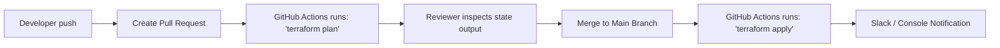

# Activity 5: Infrastructure as Code (IaC) Strategy
**Company:** Aegis Health Partners  
**Author:** Tom Jason Umali  
**Course:** Master of Science in Information Technology (ASDI)  

---

## 1. Executive Summary & Tool Selection

This document presents the Infrastructure as Code (IaC) strategy for the **Aegis Health Partners IT Asset Management (ITAM)** application. To prevent environment drift, guarantee auditability, and ensure exact parity between Development, Staging, and Production environments, all cloud infrastructure must be provisioned programmatically.

### 1.1 Selected Toolchain: Terraform & Terragrunt
* **Terraform (v1.5+):** Selected as the primary engine for declarative infrastructure provisioning. It offers a mature AWS provider, broad state-management capabilities, and a large open-source module registry.
* **Terragrunt:** Used as a thin wrapper to keep Terraform configurations **DRY (Don't Repeat Yourself)**. It manages remote state dynamically and coordinates multi-module deployment dependencies.

---

## 2. Directory Structure

The IaC codebase is split into reusable, infrastructure-agnostic **modules** and environment-specific **live configurations**:

```text
terraform/
├── environments/               # Live deployment environments (managed by Terragrunt)
│   ├── terragrunt.hcl          # Root configuration for remote state and providers
│   ├── dev/
│   │   ├── env.hcl             # Development environment variables
│   │   ├── networking/         # VPC, subnets, NAT Gateways
│   │   ├── compute/            # EKS Cluster nodes
│   │   └── database/           # RDS PostgreSQL and cache layers
│   ├── staging/
│   │   ├── env.hcl             # Staging environment variables
│   │   ├── networking/
│   │   ├── compute/
│   │   └── database/
│   └── prod/
│       ├── env.hcl             # Production environment variables
│       ├── networking/
│       ├── compute/
│       └── database/
└── modules/                    # Reusable, versioned resource modules
    ├── networking/
    │   ├── main.tf             # VPC, CIDR allocations, Route Tables, NAT
    │   ├── variables.tf
    │   └── outputs.tf
    ├── compute/
    │   ├── main.tf             # AWS EKS Cluster, Node Groups, IAM Roles
    │   ├── variables.tf
    │   └── outputs.tf
    ├── database/
    │   ├── main.tf             # RDS PostgreSQL instance, parameter/subnet groups
    │   ├── variables.tf
    │   └── outputs.tf
    └── security/
        ├── main.tf             # Security Group declarations and rules
        ├── variables.tf
        └── outputs.tf
```

---

## 3. Core Infrastructure Modules (HCL Specifications)

### 3.1 Core Database Module (`modules/database/main.tf`)
The following HCL module provisions the transactional database backend with Multi-AZ redundancy, security integration, and scaling properties.

```hcl
# modules/database/main.tf

resource "aws_db_instance" "inventory_db" {
  identifier             = "inventory-db-${var.environment}"
  engine                 = "postgres"
  engine_version         = "15.4"
  instance_class         = var.instance_class
  allocated_storage      = var.allocated_storage
  max_allocated_storage  = 500              # Auto-scaling limit
  storage_type           = "gp3"
  storage_encrypted      = true
  kms_key_id             = var.kms_key_arn   # KMS Customer Managed Key

  db_name                = var.db_name
  username               = var.db_username
  password               = var.db_password   # Ingested securely via SSM/KMS

  vpc_security_group_ids = [var.db_security_group_id]
  db_subnet_group_name   = var.db_subnet_group_name

  backup_retention_period = var.environment == "prod" ? 30 : 7
  backup_window           = "03:00-04:00"
  maintenance_window      = "Sun:04:00-Sun:05:00"

  multi_az               = var.environment == "prod" ? true : false
  skip_final_snapshot    = var.environment == "prod" ? false : true
  final_snapshot_identifier = "inventory-db-${var.environment}-final-snap"

  tags = {
    Name        = "inventory-db-${var.environment}"
    Environment = var.environment
    ManagedBy   = "terraform"
  }
}
```

### 3.2 Network Subnet Group Module (`modules/networking/main.tf`)
Ensures public routes are mapped through an Internet Gateway while application and database subnets route outward exclusively via NAT Gateways.

```hcl
# modules/networking/main.tf

resource "aws_vpc" "main" {
  cidr_block           = var.vpc_cidr
  enable_dns_hostnames = true
  enable_dns_support   = true

  tags = {
    Name        = "itam-vpc-${var.environment}"
    Environment = var.environment
    ManagedBy   = "terraform"
  }
}

resource "aws_subnet" "private_app" {
  count             = length(var.private_app_cidrs)
  vpc_id            = aws_vpc.main.id
  cidr_block        = var.private_app_cidrs[count.index]
  availability_zone = var.availability_zones[count.index]

  tags = {
    Name        = "itam-private-app-subnet-${count.index}-${var.environment}"
    Environment = var.environment
    "kubernetes.io/role/internal-elb" = "1"
  }
}
```

---

## 4. State Management & Locking Strategy

To enable secure collaboration among infrastructure teams and enforce security policies:
1. **Remote State Backend:** State files are stored in a secure, central **Amazon S3** bucket. 
2. **State Encryption:** The S3 bucket enforces default server-side encryption (`SSE-KMS`) with access logs enabled. Public access is explicitly blocked.
3. **State Locking:** **Amazon DynamoDB** tables store state locking keys. When a run is initiated, the table locks the state to prevent parallel deployments from corrupting configuration states.

---

## 5. IaC CI/CD Execution Pipeline

Infrastructure updates follow a strict pull request review flow:



1. **Pull Request Stage:** A commit triggers a lint check (`terraform fmt -check`), security scan (using `tfsec`), and a dry run (`terraform plan`).
2. **Review Stage:** The plan output is printed directly into the pull request comments for peer review.
3. **Merge Stage (Deploy):** Upon merging to `main`, a runner applies the changes (`terraform apply -auto-approve`), outputting execution times and modifications to CloudTrail.
