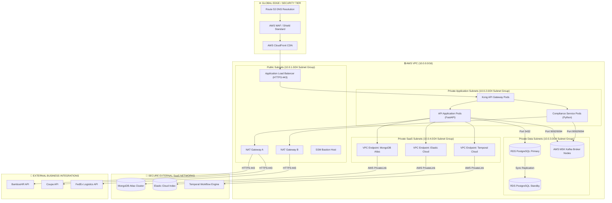
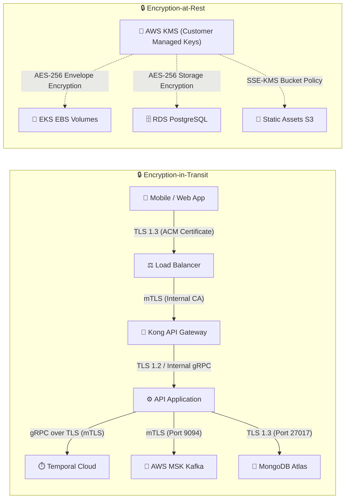

# Activity 5: Network Topology and Security Architecture Design
**Company:** Aegis Health Partners  
**Author:** Tom Jason Umali  
**Course:** Master of Science in Information Technology (ASDI)  

---

## 1. Executive Summary & Security Objectives

This document defines the comprehensive Network Topology and Security Architecture for the **Aegis Health Partners IT Asset Management (ITAM)** platform. Given the healthcare context and integration with employee health systems, the system handles sensitive administrative data and must align with stringent compliance and security frameworks (HIPAA, HITECH, and ISO/IEC 27001).

The core objectives of this security architecture are:
* **Zero Trust Network Access (ZTNA):** No network segment or service is trusted by default, regardless of its location inside or outside the VPC boundary.
* **Strict Network Segmentation:** Isolation of public ingress, application execution runtimes, data storage persistence, and third-party SaaS endpoint layers.
* **Defense in Depth:** Multiple layers of firewalls, access control lists (ACLs), security groups, and encryption protocols protecting data at every stage.
* **End-to-End Encryption:** Total protection of Data-in-Transit using TLS 1.2/1.3 and Data-at-Rest using industry-standard AES-256 keys managed via HSMs.

---

## 2. Network Segmentation & VPC Architecture

The platform is housed within a dedicated Amazon Web Services (AWS) Virtual Private Cloud (VPC) in the Singapore region (`ap-southeast-1`). The network address space utilizes the classless inter-domain routing (CIDR) block `10.0.0.0/16`, providing up to 65,536 private IP addresses.

### 2.1 Multi-AZ Subnet Allocation Matrix
To ensure High Availability (HA) and Fault Tolerance, the VPC is segmented across three Availability Zones (AZs) in the region:
* `ap-southeast-1a` (AZ1)
* `ap-southeast-1b` (AZ2)
* `ap-southeast-1c` (AZ3)

| Subnet Tier | CIDR Block | Availability Zone | Purpose & Hosted Components | Route Table Routing Target |
| :--- | :--- | :--- | :--- | :--- |
| **Public Subnet 1A** | `10.0.11.0/24` | ap-southeast-1a | ALB Ingress, NAT Gateway A, Bastion | Internet Gateway (`igw-xxxx`) |
| **Public Subnet 1B** | `10.0.12.0/24` | ap-southeast-1b | ALB Ingress, NAT Gateway B | Internet Gateway (`igw-xxxx`) |
| **Public Subnet 1C** | `10.0.13.0/24` | ap-southeast-1c | ALB Ingress | Internet Gateway (`igw-xxxx`) |
| **Private App Subnet 2A** | `10.0.21.0/24` | ap-southeast-1a | Kong API Gateway, API App, Compliance Pods | NAT Gateway A (`nat-xxxx`) |
| **Private App Subnet 2B** | `10.0.22.0/24` | ap-southeast-1b | Kong API Gateway, API App, Compliance Pods | NAT Gateway B (`nat-xxxx`) |
| **Private App Subnet 2C** | `10.0.23.0/24` | ap-southeast-1c | Kong API Gateway, API App | NAT Gateway B (`nat-xxxx`) |
| **Private Data Subnet 3A** | `10.0.31.0/24` | ap-southeast-1a | RDS PostgreSQL Main, MSK Broker 1 | Local Only (No Internet Access) |
| **Private Data Subnet 3B** | `10.0.32.0/24` | ap-southeast-1b | RDS PostgreSQL Standby, MSK Broker 2 | Local Only (No Internet Access) |
| **Private Data Subnet 3C** | `10.0.33.0/24` | ap-southeast-1c | RDS PostgreSQL Read Replica, MSK Broker 3 | Local Only (No Internet Access) |
| **Private SaaS Subnet 4A** | `10.0.41.0/24` | ap-southeast-1a | AWS PrivateLink Interface Endpoints | Private Link Endpoints to SaaS |
| **Private SaaS Subnet 4B** | `10.0.42.0/24` | ap-southeast-1b | AWS PrivateLink Interface Endpoints | Private Link Endpoints to SaaS |

---

## 3. Network Topology Diagram

The topology maps out the flow of traffic from external clients, through the edge network, load balancer, API gateways, application pods, and finally down to private database clusters and PrivateLink connections to secure external SaaS systems.



---

## 4. Firewall & Security Group Rules

Traffic is restricted strictly on a need-to-know basis. State-based AWS Security Groups act as micro-firewalls around individual component resources.

### 4.1 Security Group Matrix

| Security Group ID | Resource / Role | Inbound Protocol & Port | Allowed Source | Rationale |
| :--- | :--- | :--- | :--- | :--- |
| **`sg-alb`** | Public Load Balancer | • TCP 443 (HTTPS)<br>• TCP 80 (HTTP) | • `0.0.0.0/0`<br>• `0.0.0.0/0` | Public entrance for client browsers and devices. Redirects HTTP to HTTPS. |
| **`sg-kong`** | Kong API Gateway Pods | • TCP 8443 (HTTPS Ingress)<br>• TCP 8000 (HTTP Ingress) | • `sg-alb`<br>• `sg-alb` | Restricts gateway ingress to requests forwarded by the load balancer. |
| **`sg-app`** | API Application Pods | • TCP 8000 (App Server) | • `sg-kong` | Restricts access to app code; only the API Gateway can call APIs directly. |
| **`sg-compliance`** | Compliance Service Pods | • TCP 8080 (Worker API) | • `sg-app` / `sg-kong` | Restricts workers to calls originating from the primary application. |
| **`sg-database`** | RDS PostgreSQL Database | • TCP 5432 (Postgres Port) | • `sg-app`<br>• `sg-bastion` (Debug only) | Isolates relational databases. No direct ingress from internet or gateways. |
| **`sg-msk`** | MSK Kafka Clusters | • TCP 9094 (mTLS Kafka)<br>• TCP 9092 (PLAINTEXT Dev) | • `sg-app` / `sg-compliance`<br>• `sg-app` / `sg-compliance` | Allows applications to publish/consume events asynchronously. |
| **`sg-saas-endpoints`** | PrivateLink Endpoints | • TCP 27017 (Mongo Atlas)<br>• TCP 9243 (Elastic Cloud)<br>• TCP 7233 (Temporal Cloud) | • `sg-app`<br>• `sg-app`<br>• `sg-app` | Provides secure local interfaces mapped to external SaaS networks. |
| **`sg-bastion`** | SSM Bastion Host | • None (SSM Tunneling) | • AWS Systems Manager Console | Eliminates public SSH ports. Access managed via IAM identity policies. |

---

## 5. Network Access Control Lists (NACLs)

As a secondary stateless security layer, Network Access Control Lists (NACLs) protect subnet boundaries from catastrophic configuration mistakes.

```text
NACL Rules (Stateless Filtering)

Public Subnet NACL:
--------------------------------------------------------------------------------
Rule #  | Traffic Direction | Protocol  | Port Range  | Source/Dest  | Action
--------------------------------------------------------------------------------
100     | Inbound           | TCP       | 80, 443     | 0.0.0.0/0    | ALLOW
110     | Inbound           | TCP       | 1024-65535  | 0.0.0.0/0    | ALLOW (Ephemeral Ports)
100     | Outbound          | TCP       | 80, 443     | 0.0.0.0/0    | ALLOW (NAT outbound)
110     | Outbound          | TCP       | 1024-65535  | 0.0.0.0/0    | ALLOW (Responses)

Private Application Subnet NACL:
--------------------------------------------------------------------------------
Rule #  | Traffic Direction | Protocol  | Port Range  | Source/Dest  | Action
--------------------------------------------------------------------------------
100     | Inbound           | TCP       | 8000, 8443  | 10.0.1.0/24  | ALLOW (From ALB)
110     | Inbound           | TCP       | 1024-65535  | 10.0.3.0/24  | ALLOW (From DB Layer)
100     | Outbound          | TCP       | 5432, 9094  | 10.0.3.0/24  | ALLOW (To DB Layer)
110     | Outbound          | TCP       | 443         | 0.0.0.0/0    | ALLOW (To NAT / SaaS)

Private Data Subnet NACL:
--------------------------------------------------------------------------------
Rule #  | Traffic Direction | Protocol  | Port Range  | Source/Dest  | Action
--------------------------------------------------------------------------------
100     | Inbound           | TCP       | 5432, 9094  | 10.0.2.0/24  | ALLOW (From App Layer)
100     | Outbound          | TCP       | 1024-65535  | 10.0.2.0/24  | ALLOW (Responses to App)
```

---

## 6. Encryption Strategy

To protect health system asset records, hardware/software details, and employee-related logs, a comprehensive encryption schema is applied at all levels.



### 6.1 Encryption-in-Transit (Data-in-Motion)
No data travels in plaintext inside or outside the VPC boundary:
* **Public Ingress:** All inbound web and mobile traffic requires **TLS 1.3** (with fallback to TLS 1.2 for legacy mobile OS). SSL termination is handled at the Application Load Balancer (ALB) using a 2048-bit RSA certificate managed via **AWS Certificate Manager (ACM)**.
* **Internal Routing (VPC):** Traffic between the ALB, Kong API Gateway, and stateless FastAPI nodes is encrypted using **mTLS (Mutual TLS)** with short-lived certificates issued by **AWS ACM Private Certificate Authority (Private CA)**.
* **Database Connections:**
  * **RDS PostgreSQL:** TLS 1.2 is enforced via parameter group configurations (`ssl=on`, `ssl_min_protocol_version=TLSv1.2`).
  * **AWS MSK (Kafka):** Client connections utilize **SASL/SCRAM** combined with TLS encryption (Port 9094). Plaintext Port 9092 is disabled in production.
* **SaaS Connections (VPC Endpoints):**
  * **MongoDB Atlas:** Connectivity utilizes TLS 1.3 (Port 27017) over AWS PrivateLink.
  * **Elastic Cloud:** Enforces TLS 1.2+ (Port 9243) over VPC Endpoint interfaces.
  * **Temporal Cloud:** The SDK workers register with Temporal Cloud using client-side certificates issued via the enterprise ACM Private CA (Port 7233).

### 6.2 Encryption-at-Rest (Data-at-Storage)
All persistent storage volumes utilize hardware-based cryptographic accelerators using Customer Managed Keys (CMKs) created and rotated within **AWS KMS (Key Management Service)**:
* **EKS Compute Volumes:** Kubernetes node root directories and Persistent Volume Claims (PVCs) created via GP3 storage classes utilize envelope encryption using the EKS KMS master key.
* **RDS PostgreSQL Engine:** Automated data directory and temporary file encryption utilizing AES-256 via the RDS KMS CMK. Daily backups and read replicas inherit this encryption key automatically.
* **MongoDB Atlas:** The M30 Atlas cluster runs on encrypted AWS EBS volumes configured with Customer Managed Keys integrated via Atlas Encryption-at-Rest APIs (KMIP).
* **AWS S3 Logs & Configuration Buckets:** Enforce default server-side encryption via KMS (SSE-KMS) with automated key rotation enabled (1-year period).

---

## 7. Compliance & Perimeter Auditing

To maintain HIPAA compliance and secure the network perimeter:
* **AWS WAF (Web Application Firewall):** Positioned in front of the ALB. Configured with AWS Managed Rule Groups targeting SQL Injection (SQLi), Cross-Site Scripting (XSS), and common vulnerability exploits (OWASP Top 10).
* **VPC Flow Logs:** Captured and streamed directly to Amazon CloudWatch Logs with a 30-day retention policy. Used by compliance algorithms to scan for abnormal egress traffic or unrecognized internal port requests.
* **AWS Shield Standard:** Provides baseline, automated Layer 3 and Layer 4 DDoS protection.
* **IAM Network Policies:** Access to edit VPC routes, NAT endpoints, and Security Group configurations requires Multi-Factor Authentication (MFA) authorization and is logged via AWS CloudTrail.
