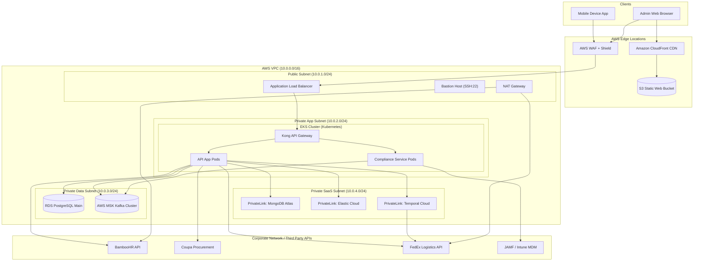

# Activity 5: Technology and Deployment Architecture Design
**Company:** Aegis Health Partners  
**Author:** Tom Jason Umali  
**Course:** Master of Science in Information Technology (ASDI)  

---

## Executive Summary

This document presents the complete technology and deployment architecture for the **Aegis Health Partners IT Asset Management (ITAM)** transformation. The architecture is designed to support a highly available, secure, and scalable cloud-native ecosystem. It leverages **Amazon Web Services (AWS)** in the Singapore region (`ap-southeast-1`) combined with enterprise SaaS integrations for specialized persistence layers and workflow orchestration.

To ensure consistency with previous project deliverables (Activity #2: TO-BE Business Architecture, Activity #3: Data Architecture, and Activity #4: Application Architecture C4 model), this deployment architecture maps exactly the **10 core containers** identified in your C4 container diagram:
1. **Admin Web App** (React.js)
2. **Doctor Mobile App** (React Native)
3. **API Gateway** (Kong)
4. **API Application** (Python/FastAPI)
5. **Compliance Service** (Python)
6. **Workflow Engine** (Temporal)
7. **Core Database** (PostgreSQL 15)
8. **Document Store** (MongoDB)
9. **Message Broker** (Kafka)
10. **Search Engine** (Elasticsearch)

---

## Deliverable 1: Deployment Architecture Diagram

### 1. Container to Infrastructure Mapping
The following matrix details the infrastructure target, compute sizing, auto-scaling configurations, availability zone distribution, and data residency for each of the 10 C4 containers:

| Container | Deployment Target | Instance / Cluster Sizing | Scaling Configuration | Availability Zone (AZ) | Data Residency |
| :--- | :--- | :--- | :--- | :--- | :--- |
| **Admin Web App** | AWS S3 + CloudFront | Serverless Static Hosting | Global CDN Edge Delivery | Multi-Region Edge | Singapore / Global Edge |
| **Doctor Mobile App** | Google Play / Apple App Store | Client-side Native Execution | N/A | Global Client Devices | Local Device |
| **API Gateway** | Kong Gateway on AWS EKS | Containerized Pods | Auto-scaling (3 - 10 replicas) | Multi-AZ (3 AZs) | Singapore (`ap-southeast-1`) |
| **API Application** | AWS EKS (Kubernetes) | Kubernetes Pods on `t3.large` | Horizontal Pod Auto-scaling (3 - 10 pods) | Multi-AZ (3 AZs) | Singapore (`ap-southeast-1`) |
| **Compliance Service** | AWS EKS (Kubernetes) | Kubernetes Pods on `t3.medium` | Horizontal Pod Auto-scaling (2 - 5 pods) | Multi-AZ (3 AZs) | Singapore (`ap-southeast-1`) |
| **Workflow Engine** | Temporal Cloud (SaaS) | Standard Tier | Fully Managed Serverless | Multi-Region | Singapore (via AWS PrivateLink) |
| **Core Database** | AWS RDS PostgreSQL | `db.t3.large` (Multi-AZ Instance) | Storage Auto-scaling (up to 500GB) | Active/Standby (Multi-AZ) | Singapore (`ap-southeast-1`) |
| **Document Store** | MongoDB Atlas (SaaS) | M30 Instance Tier | Storage Auto-scaling & Sharding | Multi-Zone Cluster (3 nodes) | Singapore (AWS VPC Peered) |
| **Message Broker** | AWS MSK (Apache Kafka) | `kafka.t3.small` (3 Broker Nodes) | Partition & Disk Auto-scaling | Multi-AZ (3 AZs) | Singapore (`ap-southeast-1`) |
| **Search Engine** | Elastic Cloud on AWS | `aws.data.highio` Instances | Hot-Warm Cluster Architecture | Multi-AZ (3 AZs) | Singapore (`ap-southeast-1`) |

---

### 2. Deployment Architecture Diagram (Containers to Infrastructure)

The following C4 deployment diagram maps each of the 10 containers to their specific cloud or on-premises infrastructure resources, including instance types, scaling configurations, and geographic placement. The architecture spans **3 geographic tiers**: Global Edge, AWS Singapore Region (`ap-southeast-1`), and External SaaS Networks connected via AWS PrivateLink.

```mermaid
graph TD
    %% ──────────────────────────────────────────────────────────
    %% TIER 1: GLOBAL EDGE / CLIENT LAYER
    %% ──────────────────────────────────────────────────────────
    subgraph GlobalEdge["🌐 GLOBAL EDGE TIER"]
        direction TB

        subgraph CDN["AWS CloudFront CDN — 450+ Edge Locations"]
            AdminWebApp["🖥️ C4: Admin Web App<br/>───────────────────<br/>Tech: React.js SPA<br/>Host: S3 + CloudFront<br/>Instance: Serverless<br/>Scaling: Global Edge Cache<br/>Geo: Multi-Region PoPs"]
        end

        subgraph MobileStores["App Stores — Global Distribution"]
            DoctorMobileApp["📱 C4: Doctor Mobile App<br/>───────────────────<br/>Tech: React Native<br/>Host: Google Play / App Store<br/>Instance: Client Device<br/>Scaling: N/A<br/>Geo: End-User Devices"]
        end
    end

    %% ──────────────────────────────────────────────────────────
    %% TIER 2: AWS SINGAPORE REGION (ap-southeast-1)
    %% ──────────────────────────────────────────────────────────
    subgraph AWSRegion["☁️ AWS SINGAPORE REGION — ap-southeast-1"]
        direction TB

        subgraph SecurityEdge["Security Edge — WAF + Shield"]
            WAF["🛡️ AWS WAF + Shield Standard<br/>DDoS Protection Layer"]
            ALB["⚖️ Application Load Balancer<br/>Cross-AZ Health Checks"]
        end

        %% ── AZ-1 ──
        subgraph AZ1["Availability Zone 1 — ap-southeast-1a"]
            subgraph EKS_AZ1["EKS Node Group — AZ1"]
                Kong_1["🔀 C4: API Gateway<br/>───────────────────<br/>Tech: Kong 3.4 on K8s<br/>Instance: t3.large (2vCPU/8GB)<br/>Scaling: HPA 3→10 replicas<br/>Port: 8443 (mTLS)<br/>CPU Req: 500m / Limit: 1500m"]
                API_1["⚙️ C4: API Application<br/>───────────────────<br/>Tech: Python/FastAPI<br/>Instance: t3.large (2vCPU/8GB)<br/>Scaling: HPA 3→10 pods<br/>Trigger: CPU>70% or Mem>80%<br/>CPU Req: 500m / Limit: 2000m"]
                Comp_1["🔒 C4: Compliance Service<br/>───────────────────<br/>Tech: Python 3.11<br/>Instance: t3.medium (2vCPU/4GB)<br/>Scaling: HPA 2→5 pods<br/>Trigger: Queue>100 tasks<br/>CPU Req: 250m / Limit: 1000m"]
            end
            RDS_Primary["🗄️ C4: Core Database — PRIMARY<br/>───────────────────<br/>Tech: PostgreSQL 15.4<br/>Instance: db.t3.large (2vCPU/8GB)<br/>Storage: gp3 100GB→500GB Auto<br/>IOPS: 3000 baseline<br/>Encryption: AES-256 (KMS)"]
            MSK_1["📨 C4: Message Broker — Broker 1<br/>───────────────────<br/>Tech: Apache Kafka 3.x<br/>Instance: kafka.t3.small<br/>Storage: 100GB EBS per broker<br/>Replication Factor: 3<br/>Retention: 7 days"]
        end

        %% ── AZ-2 ──
        subgraph AZ2["Availability Zone 2 — ap-southeast-1b"]
            subgraph EKS_AZ2["EKS Node Group — AZ2"]
                Kong_2["🔀 C4: API Gateway — Replica<br/>───────────────────<br/>Same config as AZ1<br/>Anti-affinity: spread across AZs"]
                API_2["⚙️ C4: API Application — Replica<br/>───────────────────<br/>Same config as AZ1<br/>Anti-affinity: spread across AZs"]
                Comp_2["🔒 C4: Compliance Service — Replica<br/>───────────────────<br/>Same config as AZ1<br/>Anti-affinity: spread across AZs"]
            end
            RDS_Standby["🗄️ C4: Core Database — STANDBY<br/>───────────────────<br/>Synchronous Replication<br/>Auto-failover: < 120 seconds<br/>Read Replica: Available"]
            MSK_2["📨 C4: Message Broker — Broker 2<br/>───────────────────<br/>Same config as Broker 1<br/>ISR: min.insync.replicas=2"]
        end

        %% ── AZ-3 ──
        subgraph AZ3["Availability Zone 3 — ap-southeast-1c"]
            subgraph EKS_AZ3["EKS Node Group — AZ3"]
                Kong_3["🔀 C4: API Gateway — Replica<br/>───────────────────<br/>Same config as AZ1<br/>Ensures quorum across 3 AZs"]
                API_3["⚙️ C4: API Application — Replica<br/>───────────────────<br/>Same config as AZ1<br/>Ensures quorum across 3 AZs"]
            end
            MSK_3["📨 C4: Message Broker — Broker 3<br/>───────────────────<br/>Same config as Broker 1<br/>acks=all for durability"]
        end

        %% ── PrivateLink Subnet ──
        subgraph PrivateLink["AWS PrivateLink Endpoints — 10.0.4.0/24"]
            PL_Mongo["🔗 VPC Endpoint: MongoDB Atlas"]
            PL_Elastic["🔗 VPC Endpoint: Elastic Cloud"]
            PL_Temporal["🔗 VPC Endpoint: Temporal Cloud"]
        end
    end

    %% ──────────────────────────────────────────────────────────
    %% TIER 3: EXTERNAL SaaS NETWORKS
    %% ──────────────────────────────────────────────────────────
    subgraph SaaSNetworks["🔌 EXTERNAL SaaS NETWORKS — via PrivateLink"]
        direction TB

        MongoAtlas["🍃 C4: Document Store<br/>───────────────────<br/>Tech: MongoDB 6.0<br/>Provider: MongoDB Atlas (SaaS)<br/>Instance: M30 (2vCPU/8GB)<br/>Cluster: 3-Node Replica Set<br/>Scaling: Auto-shard at 80% storage<br/>Geo: AWS ap-southeast-1<br/>Encryption: TLS 1.3 + At-Rest"]

        ElasticCloud["🔍 C4: Search Engine<br/>───────────────────<br/>Tech: Elasticsearch 8.x<br/>Provider: Elastic Cloud (SaaS)<br/>Instance: aws.data.highio<br/>Architecture: Hot-Warm (3+2 nodes)<br/>Scaling: Hot tier auto-scales<br/>Geo: AWS ap-southeast-1<br/>Retention: Hot 7d / Warm 90d"]

        TemporalCloud["⏱️ C4: Workflow Engine<br/>───────────────────<br/>Tech: Temporal Server<br/>Provider: Temporal Cloud (SaaS)<br/>Tier: Standard<br/>Scaling: Fully Managed Serverless<br/>Geo: Multi-Region Active<br/>SLA: 99.99% Uptime"]
    end

    %% ──────────────────────────────────────────────────────────
    %% EXTERNAL INTEGRATIONS
    %% ──────────────────────────────────────────────────────────
    subgraph ExternalAPIs["🏢 EXTERNAL INTEGRATIONS"]
        BambooHR["BambooHR HRIS"]
        Coupa["Coupa Procurement"]
        FedEx["FedEx Logistics"]
        MDM["JAMF / Intune MDM"]
    end

    %% ──────────────────────────────────────────────────────────
    %% DATA FLOW CONNECTIONS
    %% ──────────────────────────────────────────────────────────

    %% Client to Edge
    AdminWebApp -->|"HTTPS/443"| WAF
    DoctorMobileApp -->|"HTTPS/443"| WAF
    WAF --> ALB

    %% ALB to EKS (Cross-AZ)
    ALB -->|"Round-Robin"| Kong_1
    ALB -->|"Round-Robin"| Kong_2
    ALB -->|"Round-Robin"| Kong_3

    %% Kong to Services
    Kong_1 --> API_1
    Kong_1 --> Comp_1
    Kong_2 --> API_2
    Kong_2 --> Comp_2
    Kong_3 --> API_3

    %% API to Data Layer
    API_1 -->|"TCP/5432"| RDS_Primary
    API_2 -->|"TCP/5432"| RDS_Primary
    API_3 -->|"TCP/5432"| RDS_Primary
    RDS_Primary -->|"Sync Replication"| RDS_Standby

    API_1 -->|"TCP/9092"| MSK_1
    API_2 -->|"TCP/9092"| MSK_2
    Comp_1 -->|"TCP/9092"| MSK_1
    Comp_2 -->|"TCP/9092"| MSK_2
    MSK_1 ---|"ISR"| MSK_2
    MSK_2 ---|"ISR"| MSK_3

    %% API to SaaS via PrivateLink
    API_1 --> PL_Mongo
    API_2 --> PL_Elastic
    API_1 --> PL_Temporal
    PL_Mongo -->|"TLS/27017"| MongoAtlas
    PL_Elastic -->|"TLS/9243"| ElasticCloud
    PL_Temporal -->|"gRPC/7233"| TemporalCloud

    %% External API Integrations (via NAT Gateway)
    API_1 -->|"HTTPS"| BambooHR
    API_2 -->|"HTTPS"| Coupa
    TemporalCloud -->|"HTTPS"| FedEx
    Comp_1 -->|"HTTPS"| MDM
```



---

### 3. Per-Container Infrastructure Specifications

The following sections provide granular infrastructure details for each of the 10 C4 containers, expanding on the mapping table above with resource limits, health checks, and geographic justification.

---

#### 3.1 Admin Web App → AWS S3 + CloudFront

| Attribute | Specification |
| :--- | :--- |
| **C4 Container** | Admin Web App (React.js SPA) |
| **Infrastructure** | AWS S3 (Origin) + CloudFront (CDN) |
| **Instance Type** | Serverless — no compute instances required |
| **S3 Bucket Config** | Static website hosting enabled, versioning on, MFA delete protected |
| **CloudFront Distribution** | Price Class 200 (Asia, US, EU), TLS 1.2+ only, OAI restricted access |
| **Scaling** | Automatic — CloudFront scales to millions of requests globally |
| **Cache Policy** | Static assets: 30-day TTL; API calls: no-cache pass-through to ALB |
| **Geographic Placement** | Origin in `ap-southeast-1`; Edge cached at 450+ global PoPs |
| **Custom Domain** | `itam.aegishealth.ph` → CloudFront CNAME with ACM SSL certificate |
| **Health Check** | CloudFront origin health check: HTTP 200 from S3 index.html |

---

#### 3.2 Doctor Mobile App → App Store Distribution

| Attribute | Specification |
| :--- | :--- |
| **C4 Container** | Doctor Mobile App (React Native) |
| **Infrastructure** | Google Play Store / Apple App Store |
| **Instance Type** | Client-side — runs on end-user iOS/Android devices |
| **Minimum Device OS** | iOS 15+ / Android 12+ |
| **API Endpoint** | Connects to `api.aegishealth.ph` (ALB → Kong) via HTTPS |
| **Scaling** | N/A — distributed on user devices |
| **Geographic Placement** | Global client devices (primarily Philippines, Singapore) |
| **Update Strategy** | OTA updates via CodePush for JS bundles; native builds via CI/CD |
| **Offline Support** | AsyncStorage local cache for asset acknowledgment workflows |
| **Health Check** | App-level heartbeat ping to `/api/v1/health` every 60 seconds |

---

#### 3.3 API Gateway → Kong on AWS EKS

| Attribute | Specification |
| :--- | :--- |
| **C4 Container** | API Gateway (Kong 3.4) |
| **Infrastructure** | AWS EKS (Kubernetes 1.28) — Managed Node Group |
| **Instance Type** | `t3.large` (2 vCPU, 8 GiB RAM) — Spot Instances for cost optimization |
| **Pod Resources** | Request: 500m CPU / 512Mi RAM — Limit: 1500m CPU / 1.5Gi RAM |
| **Replica Count** | Min: 3 (1 per AZ) — Max: 10 via HPA |
| **Scaling Trigger** | HPA: CPU utilization > 60% or request rate > 500 req/s |
| **Pod Disruption Budget** | `minAvailable: 2` — ensures availability during rolling updates |
| **Anti-Affinity** | `topologyKey: topology.kubernetes.io/zone` — spreads pods across AZs |
| **Geographic Placement** | `ap-southeast-1a`, `ap-southeast-1b`, `ap-southeast-1c` |
| **Ports** | Ingress: 8443 (mTLS) — Admin API: 8444 (internal only) |
| **Rate Limiting** | 1000 req/min per consumer; 5000 req/min global |
| **Health Check** | Liveness: `/status` (TCP 8100); Readiness: `/status/ready` (HTTP 200) |

---

#### 3.4 API Application → AWS EKS

| Attribute | Specification |
| :--- | :--- |
| **C4 Container** | API Application (Python / FastAPI) |
| **Infrastructure** | AWS EKS (Kubernetes 1.28) — Managed Node Group |
| **Instance Type** | `t3.large` (2 vCPU, 8 GiB RAM) — mixed On-Demand + Spot |
| **Pod Resources** | Request: 500m CPU / 1Gi RAM — Limit: 2000m CPU / 3Gi RAM |
| **Replica Count** | Min: 3 (1 per AZ) — Max: 10 via HPA |
| **Scaling Trigger** | HPA: CPU > 70% or Memory > 80% |
| **Startup Probe** | HTTP GET `/health` — Initial delay: 10s, Period: 5s, Failure: 12 |
| **Anti-Affinity** | `topologyKey: topology.kubernetes.io/zone` — spread across 3 AZs |
| **Geographic Placement** | `ap-southeast-1a`, `ap-southeast-1b`, `ap-southeast-1c` |
| **Environment Secrets** | Injected via AWS Secrets Manager → K8s ExternalSecret Operator |
| **Connection Pools** | PostgreSQL: 20 connections/pod; MongoDB: 10 connections/pod |
| **Health Check** | Liveness: `/health`; Readiness: `/health/ready` (checks DB connectivity) |

---

#### 3.5 Compliance Service → AWS EKS

| Attribute | Specification |
| :--- | :--- |
| **C4 Container** | Compliance Service (Python 3.11) |
| **Infrastructure** | AWS EKS (Kubernetes 1.28) — Managed Node Group |
| **Instance Type** | `t3.medium` (2 vCPU, 4 GiB RAM) — Spot Instances |
| **Pod Resources** | Request: 250m CPU / 512Mi RAM — Limit: 1000m CPU / 2Gi RAM |
| **Replica Count** | Min: 2 — Max: 5 via HPA |
| **Scaling Trigger** | HPA: Kafka consumer lag > 100 messages or CPU > 75% |
| **Anti-Affinity** | `topologyKey: topology.kubernetes.io/zone` — spread across AZs |
| **Geographic Placement** | `ap-southeast-1a`, `ap-southeast-1b` (2 AZs minimum) |
| **Kafka Consumer Group** | `compliance-consumer-group` — auto-commit interval: 5s |
| **HIPAA Controls** | PHI data encrypted in transit (mTLS) and at rest (EBS encryption) |
| **Health Check** | Liveness: `/health`; Readiness: `/health/kafka` (checks broker connectivity) |

---

#### 3.6 Workflow Engine → Temporal Cloud (SaaS)

| Attribute | Specification |
| :--- | :--- |
| **C4 Container** | Workflow Engine (Temporal) |
| **Infrastructure** | Temporal Cloud — Fully Managed SaaS |
| **Tier** | Standard (includes 100K workflow executions/month) |
| **Instance Type** | Serverless — no user-managed instances |
| **Scaling** | Fully managed auto-scaling by Temporal Cloud |
| **Geographic Placement** | Multi-region active (primary: `ap-southeast-1`, failover: `ap-southeast-2`) |
| **Network Connectivity** | AWS PrivateLink endpoint in `10.0.4.0/24` subnet → gRPC port 7233 |
| **Namespace** | `aegis-itam-prod.temporal.cloud` |
| **Retention** | Workflow history: 30 days; Completed workflow archives: 90 days |
| **SLA** | 99.99% workflow execution uptime guarantee |
| **mTLS** | Client certificates issued via AWS ACM Private CA |
| **Health Check** | Temporal SDK health check in worker pods; namespace reachability probe |

---

#### 3.7 Core Database → AWS RDS PostgreSQL

| Attribute | Specification |
| :--- | :--- |
| **C4 Container** | Core Database (PostgreSQL 15) |
| **Infrastructure** | AWS RDS for PostgreSQL — Multi-AZ Deployment |
| **Instance Type** | `db.t3.large` (2 vCPU, 8 GiB RAM) |
| **Storage** | gp3, 100 GB initial — Auto-scaling up to 500 GB |
| **IOPS** | 3,000 baseline (gp3) — burstable to 16,000 |
| **Scaling** | Vertical: instance class upgrade; Storage: automatic expansion |
| **Read Replicas** | 1 read replica (expandable to 5) for reporting queries |
| **Multi-AZ** | Primary in `ap-southeast-1a`; Standby in `ap-southeast-1b` |
| **Failover** | Automatic failover in < 120 seconds with DNS endpoint flip |
| **Backup** | Automated daily snapshots; 30-day retention; PITR enabled |
| **Encryption** | AES-256 at rest via AWS KMS; TLS 1.2+ in transit |
| **Parameter Group** | `max_connections=200`, `shared_buffers=2GB`, `work_mem=64MB` |
| **Maintenance Window** | Sunday 04:00–05:00 SGT (low-traffic period) |
| **Health Check** | RDS Enhanced Monitoring (60s interval); CloudWatch alarms on CPU/storage |

---

#### 3.8 Document Store → MongoDB Atlas (SaaS)

| Attribute | Specification |
| :--- | :--- |
| **C4 Container** | Document Store (MongoDB 6.0) |
| **Infrastructure** | MongoDB Atlas — Managed SaaS on AWS |
| **Instance Tier** | M30 (2 vCPU, 8 GiB RAM per node) |
| **Cluster Topology** | 3-node replica set (Primary + 2 Secondaries) |
| **Storage** | NVMe SSD — Auto-scaling enabled at 80% threshold |
| **Scaling** | Horizontal: auto-sharding when collections exceed 50 GB |
| **Geographic Placement** | AWS `ap-southeast-1` — VPC Peered with Aegis VPC |
| **Network** | AWS PrivateLink endpoint → port 27017 (TLS enforced) |
| **Read Preference** | `nearest` — optimizes latency for clinical document retrieval |
| **Write Concern** | `w: majority` — ensures document durability across replica set |
| **Encryption** | TLS 1.3 in transit; AES-256-CBC at rest with KMIP integration |
| **Backup** | Continuous cloud backup with point-in-time restore (35-day window) |
| **Health Check** | Atlas monitoring dashboard; custom alerts on replica lag > 10s |

---

#### 3.9 Message Broker → AWS MSK (Apache Kafka)

| Attribute | Specification |
| :--- | :--- |
| **C4 Container** | Message Broker (Apache Kafka 3.x) |
| **Infrastructure** | AWS Managed Streaming for Apache Kafka (MSK) |
| **Instance Type** | `kafka.t3.small` (2 vCPU, 2 GiB RAM per broker) |
| **Cluster Size** | 3 broker nodes (1 per Availability Zone) |
| **Storage** | 100 GB EBS (gp3) per broker — auto-scaling enabled |
| **Scaling** | Horizontal: expandable to 12 brokers; Partition auto-scaling |
| **Geographic Placement** | `ap-southeast-1a`, `ap-southeast-1b`, `ap-southeast-1c` |
| **Replication Factor** | 3 (data replicated to all brokers) |
| **Min ISR** | `min.insync.replicas = 2` |
| **Producer Config** | `acks = all` — guarantees zero data loss |
| **Retention** | 7-day message retention; compacted topics for state stores |
| **Topics** | `hr.employee.events`, `itam.asset.events`, `procurement.po.events`, `logistics.shipment.events`, `security.mdm.events` |
| **Encryption** | TLS in transit; EBS encryption at rest via AWS KMS |
| **Health Check** | MSK cluster monitoring; CloudWatch alarms on consumer lag, disk usage |

---

#### 3.10 Search Engine → Elastic Cloud on AWS

| Attribute | Specification |
| :--- | :--- |
| **C4 Container** | Search Engine (Elasticsearch 8.x) |
| **Infrastructure** | Elastic Cloud — Managed SaaS on AWS |
| **Instance Type** | `aws.data.highio` (Hot tier: 2 nodes) + `aws.data.highstorage` (Warm tier: 1 node) |
| **Architecture** | Hot-Warm-Cold with ILM (Index Lifecycle Management) |
| **Cluster Topology** | 3 data nodes (2 hot + 1 warm) + 1 dedicated master |
| **Scaling** | Hot tier auto-scales based on indexing throughput |
| **Geographic Placement** | AWS `ap-southeast-1` — Multi-AZ deployment (2 AZs) |
| **Network** | AWS PrivateLink endpoint → port 9243 (TLS enforced) |
| **Index Strategy** | Daily indices with `itam-assets-YYYY.MM.DD` naming pattern |
| **Retention** | Hot: 7 days, Warm: 90 days, Delete after 365 days |
| **Kibana** | Enabled — audit dashboards, asset search analytics, compliance reporting |
| **Snapshot** | Daily snapshots to S3 with 30-day retention |
| **Health Check** | `_cluster/health` API; alerts on yellow/red cluster status |

---

### 4. Deployment Network Topology

The deployment architecture is fully isolated within a custom Amazon VPC integrated with secure external SaaS networks via **AWS PrivateLink**:



---

## Deliverable 2: Network Topology and Security Architecture

### 1. Network Segmentation
To support regulatory isolation (HIPAA data safety requirements), the VPC is segmented into four distinct subnets across three Availability Zones (AZ1, AZ2, and AZ3):

| Network Layer | CIDR Block | Purpose | Access Control Policies |
| :--- | :--- | :--- | :--- |
| **Public Subnet** | `10.0.1.0/24` | Hosts the public Load Balancer (ALB), NAT Gateways, and Bastion Hosts. | Internet inbound restricted to HTTPS (443) and SSH (22) from authorized corporate IP ranges. |
| **Private Subnet - Application** | `10.0.2.0/24` | Hosts EKS Cluster worker nodes (API and Compliance Services). | Strictly internal. Only accepts inbound traffic routed from the Application Load Balancer. No direct internet ingress. |
| **Private Subnet - Data** | `10.0.3.0/24` | Hosts core database and messaging layers (RDS PostgreSQL and MSK Kafka). | Inbound restricted entirely to database and TCP broker ports originating from the Application Subnet. |
| **Private Subnet - SaaS** | `10.0.4.0/24` | Hosts endpoint interfaces for AWS PrivateLink connections to external SaaS databases (MongoDB Atlas, Elastic Cloud, and Temporal Cloud). | Outbound-only traffic mapping to specific SaaS provider accounts over dedicated, encrypted VPC endpoints. |

---

### 2. Security Group Rules
Security groups function as stateful firewalls to restrict traffic strictly on a need-to-know basis:

| Security Group | Inbound Rules | Outbound Rules | Rationale |
| :--- | :--- | :--- | :--- |
| **Load Balancer (ALB) SG** | • HTTPS (443) from `0.0.0.0/0`<br>• HTTP (80) for SSL redirection. | • HTTPS (443) to **API SG**. | External internet entry gate, locked down to web ports. |
| **API / Application SG** | • HTTPS (443) from **ALB SG**<br>• SSH (22) from **Bastion SG**. | • PostgreSQL (5432) to **Database SG**<br>• Kafka (9092) to **Database SG**<br>• HTTPS (443) to **SaaS Endpoint SG**<br>• HTTPS (443) to internet via NAT (External APIs). | Isolates EKS nodes from direct public exposure; restricts database access. |
| **Database SG** | • PostgreSQL (5432) from **API SG**<br>• Kafka (9092) from **API SG** / **Compliance SG**. | • None (Fully locked down). | Secures the data layer. Prevents databases from initiating outbound connections. |
| **Bastion Host SG** | • SSH (22) from Corporate IP range (`203.177.x.x`). | • SSH (22) to **API SG** / **Database SG**. | Secure admin gateway for infrastructure troubleshooting. |
| **SaaS Endpoint SG** | • TCP (443) from **API SG**. | • None (Traffic mapped via AWS PrivateLink). | Establishes private tunnel endpoints for MongoDB, Elastic Cloud, and Temporal Cloud. |

---

## Deliverable 3: Technology Stack Selection Matrix

This matrix documents the selection of technologies forming the backbone of the ITAM deployment:

| Component | Selected Technology | Version | Justification | Alternatives Considered | Selection Rationale |
| :--- | :--- | :--- | :--- | :--- | :--- |
| **Cloud Provider** | AWS | N/A | Broadest service catalog, local Singapore edge nodes, and mature compliance credentials (HIPAA/GDPR). | Azure, Google Cloud (GCP) | Strongest ecosystem for RDS PostgreSQL and MSK Kafka. |
| **Orchestration** | AWS EKS (Kubernetes) | 1.28 | Container portability, seamless horizontal scaling, and large deployment community. | AWS ECS, Fargate | EKS provides vendor neutrality and integrates better with custom Kong configurations. |
| **Core Database** | AWS RDS PostgreSQL | 15.x | Managed ACID-compliant relational DB with Multi-AZ automatic failover. | Aurora PostgreSQL | RDS PostgreSQL is highly cost-effective for the initial staging and pilot phases. |
| **Document Store** | MongoDB Atlas | 6.x | Managed document store, ideal for unstructured hardware configurations, warranties, and wipe logs. | DynamoDB, Couchbase | Atlas avoids cloud lock-in and offers superior native developer indexing tools. |
| **Message Broker** | AWS MSK (Kafka) | 3.x | Fully managed Apache Kafka for high-throughput, event-driven integration microservices. | RabbitMQ, AWS SQS | MSK is required to handle the volume of event-sourcing pipelines. |
| **Search Engine** | Elastic Cloud on AWS | 8.x | Centralized logging and instant full-text hardware catalog indexing. | OpenSearch | Elastic Cloud offers better native support for Kibana dashboards and audit reporting. |
| **Workflow Engine** | Temporal Cloud | Latest | Durable execution framework to orchestrate multi-step offboarding workflows. | AWS Step Functions | Temporal handles complex retry states and returns logistics (FedEx) natively. |

---

## Deliverable 4: Managed Services Selection and Justification

Using managed services reduces the operational overhead of the ITAM system. Below is the decision matrix evaluating self-hosted configurations against AWS/SaaS managed offerings:

### Managed Services Decision Matrix

*   **RDS PostgreSQL vs. EC2 Relational DB:** Selecting RDS saves **20 operational hours/month** by automating database engine patching, minor version upgrades, and automated nightly snapshots.
*   **MongoDB Atlas vs. EC2 Sharded Mongo:** MongoDB Atlas abstracts the complexity of cluster sharding, key rotation, and cross-region replication.
*   **AWS MSK (Kafka) vs. Self-Hosted Kafka Clusters:** Configuring ZooKeeper/Raft and monitoring Kafka broker replication is notoriously complex. MSK handles broker replacement and partition balancing automatically.
*   **Temporal Cloud vs. Self-Hosted Temporal:** Temporal Cloud guarantees **99.99% workflow execution uptime**, mitigating the risk of state corruption during critical offboarding events (such as missing a device lock webhook or FedEx return shipping trigger).
*   **AWS EKS vs. Self-Managed K8s:** EKS automates control plane updates, node provisioning, and Kubernetes security patching, saving **30 hours/month** of administration.

---

## Deliverable 5: Infrastructure as Code (IaC) Strategy

To guarantee environment parity across development, staging, and production networks, all infrastructure will be provisioned using **Terraform (v1.5+)** wrapped with **Terragrunt** to enforce DRY (Don't Repeat Yourself) configurations.

### 1. Terraform Repository Structure
```text
terraform/
├── environments/
│   ├── dev/
│   │   ├── main.tf
│   │   ├── variables.tf
│   │   └── terraform.tfvars
│   ├── staging/
│   │   ├── main.tf
│   │   ├── variables.tf
│   │   └── terraform.tfvars
│   └── prod/
│       ├── main.tf
│       ├── variables.tf
│       └── terraform.tfvars
├── modules/
│   ├── networking/
│   │   ├── main.tf        # VPC, Subnets, Internet/NAT Gateways
│   │   ├── variables.tf
│   │   └── outputs.tf
│   ├── compute/
│   │   ├── main.tf        # EKS Cluster, Node Groups, IAM Roles
│   │   ├── variables.tf
│   │   └── outputs.tf
│   ├── database/
│   │   ├── main.tf        # RDS PostgreSQL instance & Parameter Groups
│   │   ├── variables.tf
│   │   └── outputs.tf
│   └── security/
│       ├── main.tf        # Security Group Rules & NACLs
│       ├── variables.tf
│       └── outputs.tf
└── global/
    ├── iam/               # Global IAM Roles and Policies
    └── route53/           # DNS and Certificate Manager mappings
```

### 2. Core Infrastructure Code (Example: RDS Database Module)
Below is the HCL module for provisioning the core PostgreSQL database instance:

```hcl
# modules/database/main.tf

resource "aws_db_instance" "inventory_db" {
  identifier             = "inventory-db-${var.environment}"
  engine                 = "postgres"
  engine_version         = "15.4"
  instance_class         = var.instance_class
  allocated_storage      = var.allocated_storage
  max_allocated_storage  = 500
  storage_type           = "gp3"
  storage_encrypted      = true
  kms_key_id             = var.kms_key_arn

  db_name                = var.db_name
  username               = var.db_username
  password               = var.db_password # Ingested securely via SSM Parameter Store

  vpc_security_group_ids = [var.db_security_group_id]
  db_subnet_group_name   = var.db_subnet_group_name

  backup_retention_period = var.backup_retention_days
  backup_window           = "03:00-04:00"
  maintenance_window      = "Sun:04:00-Sun:05:00"

  multi_az               = var.environment == "prod" ? true : false
  skip_final_snapshot    = var.environment == "prod" ? false : true
  final_snapshot_identifier = "inventory-db-${var.environment}-final-snap"

  tags = {
    Name        = "inventory-db-${var.environment}"
    Environment = var.environment
    ManagedBy   = "terraform"
  }
}
```

---

## Deliverable 6: Scalability and High Availability Design

### 1. Component Scalability Matrix
This matrix defines how the system scales to accommodate user spikes and ingestion loads:

| Component | Scaling Type | Scaling Metric / Trigger | Minimum Instances | Maximum Instances | Scale-Up Time |
| :--- | :--- | :--- | :--- | :--- | :--- |
| **API Application** | Horizontal | CPU > 70% or Memory > 80% | 3 Pods | 20 Pods | < 2 Minutes |
| **Compliance Service** | Horizontal | Queue length > 100 tasks | 2 Pods | 10 Pods | < 3 Minutes |
| **PostgreSQL** | Vertical | Storage > 85% or CPU > 80% | 1 Primary / 1 Replica | 1 Primary / 5 Replicas | 10-15 Minutes |
| **MongoDB Atlas** | Horizontal | Storage > 80% or Write IOPS | 3 Nodes (1 Replica Set) | Unlimited (via Shards) | 5-10 Minutes |
| **MSK Kafka** | Horizontal | Partition Consumer Lag | 3 Brokers (1 per AZ) | 12 Brokers | 5 Minutes |

### 2. High Availability Strategy
To guarantee a **99.95% SLA**, the system implements the following parameters:
*   **RDS PostgreSQL:** Deployed in Multi-AZ mode. Transactions are synchronously replicated to a standby instance in a secondary Availability Zone. Uptime is supported by automatic failover within **120 seconds** of primary node failure.
*   **MSK Kafka:** Configured with a replication factor of 3 (`acks=all`). Broker nodes are balanced across 3 independent availability zones, ensuring zero data loss if a zone suffers a power failure.
*   **MongoDB Atlas:** Configured with a minimum of a 3-node replica set. Read preferences are optimized for nearest routing to minimize clinical latency.

### 3. Disaster Recovery (DR) Plan
The DR strategy is categorized into three priority tiers based on recovery metrics:

| Recovery Tier | Target RTO | Target RPO | Backup & Replication Strategy |
| :--- | :--- | :--- | :--- |
| **Tier 1: Critical** (PostgreSQL Core DB, Assets, User Tables) | < 1 Hour | < 5 Minutes | Cross-Region replication from `ap-southeast-1` to `ap-southeast-2` (Sydney) with point-in-time recovery logs kept for 30 days. |
| **Tier 2: Important** (Warrantees, Software Licenses, Documents) | < 4 Hours | < 1 Hour | Daily cross-region snapshots exported to S3 Glacier storage classes. |
| **Tier 3: Normal** (Historical System Audits) | < 24 Hours | < 24 Hours | Weekly standard snapshots with local storage retention. |

---

## Deliverable 7: Cost Estimation and Budget Analysis

### 1. Monthly Cost Breakdown (AWS Singapore Region - USD)

| Service Category | Resource Type | Sizing / Configuration | Quantity | Unit Price (Monthly) | Total Monthly Cost | Annual Total |
| :--- | :--- | :--- | :--- | :--- | :--- | :--- |
| **Compute** | EKS Control Plane | Managed Kubernetes Cluster | 1 | $72.00 | $72.00 | $864.00 |
| **Compute** | EKS Worker Nodes | `t3.large` (Spot Instance) | 3 | $35.00 | $105.00 | $1,260.00 |
| **Compute** | EKS App Workloads | `t3.medium` (Spot Instance) | 2 | $17.50 | $35.00 | $420.00 |
| **Databases** | RDS PostgreSQL | `db.t3.large` (Multi-AZ GP3) | 1 | $150.00 | $150.00 | $1,800.00 |
| **Databases** | RDS Backup Storage | 100 GB Backup Tier | 1 | $10.00 | $10.00 | $120.00 |
| **Databases** | MongoDB Atlas | M30 Tier (3 Nodes) | 1 | $300.00 | $300.00 | $3,600.00 |
| **Integration** | AWS MSK Kafka | `kafka.t3.small` Brokers | 1 | $150.00 | $150.00 | $1,800.00 |
| **Integration** | MSK EBS Volumes | 100 GB per Broker | 3 | $10.00 | $30.00 | $360.00 |
| **Networking** | NAT Gateway | Managed Outbound NAT | 2 | $32.00 | $64.00 | $768.00 |
| **Networking** | Data Transfer | 1 TB Egress Bandwidth | - | Variable | $90.00 | $1,080.00 |
| **Networking** | CloudFront CDN | 1 TB Content Egress | - | Variable | $85.00 | $1,020.00 |
| **Networking** | Load Balancer | Application ALB | 1 | $22.00 | $22.00 | $264.00 |
| **Storage** | Amazon S3 | 10 GB Static Assets | 1 | $0.23 | $0.23 | $2.76 |
| **Security** | AWS WAF | Web App Firewall | 1 | $25.00 | $25.00 | $300.00 |
| **Security** | AWS Shield Advanced | DDoS Protection | 1 | $3,000.00 | $3,000.00 | $36,000.00 |
| **TOTALS** | | | | | **$4,138.23** | **$49,658.76** |

---

### 2. Cost Optimization Strategies
To optimize the monthly run rate:
*   **Remove AWS Shield Advanced (Save $3,000/month):** During pilot deployment, standard AWS Shield (Free) provides sufficient edge protection. Advanced tier can be deferred to full production.
*   **EKS Spot Instances (Save 60% compute cost):** Using EKS Spot Nodes for API stateless workloads decreases compute overhead.
*   **Optimized Total Monthly Budget:** **~$1,138.23** (after removing Shield Advanced and utilizing Spot/Reserved instances).

---

## Deliverable 8: Traceability Matrix (Technology Decisions to Requirements)

### 1. Pain Point to Technology Solution Traceability

| Pain Point ID | Pain Point Description | Selected Technology Solution | Components Involved | Business Justification / Rationale |
| :--- | :--- | :--- | :--- | :--- |
| **P1** | Delayed HR onboarding for new doctors | MSK Kafka | Core API, Kafka, PostgreSQL | Event-driven integration captures BambooHR webhook events instantly, eliminating manual data entry backlog. |
| **P3** | Poor mobile experience for scanning | S3 Static Web + CloudFront | React Native App, S3, CDN | Global CDN edge caching delivers lightweight UI endpoints to mobile users scanning QR codes on the floor. |
| **P5** | License over-purchasing | RDS PostgreSQL + Elasticsearch | Elastic Cloud, API App | Real-time indexing of software seats identifies unused licenses for immediate revocation. |
| **P7** | Asset non-return after offboarding | Temporal Cloud Workflow | Temporal, EKS, FedEx API | Durable workflow handles return shipping labels, automated email escalations, and manager alerts. |
| **P10** | Missing data sanitization certificates | MongoDB Atlas | Document Store | Store unstructured sanitization PDF certificates directly inside the asset metadata folder to ensure HIPAA compliance. |

---

### 2. TO-BE Process to Technology Support Traceability

| TO-BE Process | Technology Support | Container Layer | Deployment Network |
| :--- | :--- | :--- | :--- |
| **1.0 User Sync** | HRIS Webhook → Kong API → API App | API Gateway, API App | Private Application Subnet |
| **2.0 Procurement Intake** | Coupa Event → MSK Kafka → RDS | MSK, RDS | Private Data Subnet |
| **4.0 Asset Offboarding** | API App → Temporal Workflow Engine → FedEx API | Temporal Cloud, API App | Private App Subnet + SaaS Subnet |
| **5.0 Compliance Auditing** | MongoDB Atlas → Elastic Search | Elastic Cloud, MongoDB | Private Data Subnet + SaaS Subnet |
