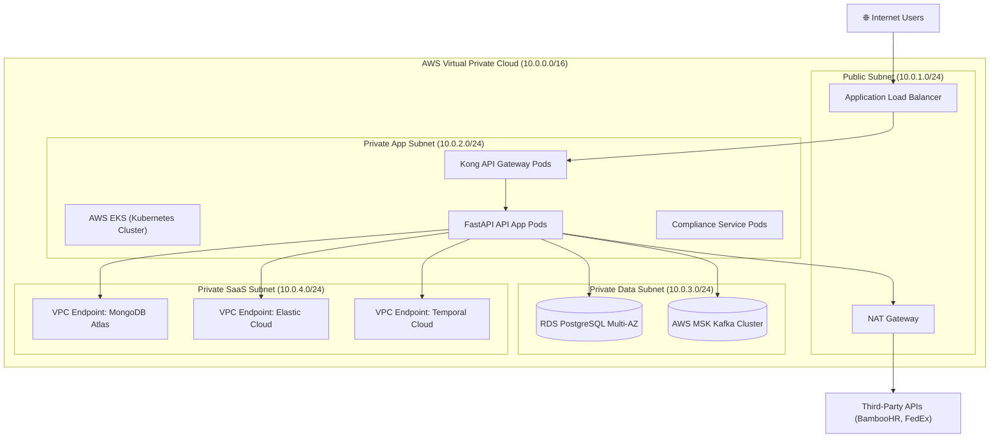

# Aegis Health Partners — ITAM Intelligence Platform Deployment Guide
**Author:** Tom Jason Umali  
**Course:** Master of Science in Information Technology (ASDI)  

---

This document provides complete, step-by-step instructions for deploying the **Aegis Health Partners IT Asset Management (ITAM) Intelligence Platform** prototype.

The guide covers:
1. **Prerequisites & System Requirements**
2. **Local Deployment (Bare Metal / Node.js only)**
3. **Containerized Deployment (Docker Compose Multi-Database Stack)**
4. **Production Cloud Deployment Plan (AWS Enterprise Architecture)**
5. **Post-Deployment Verification**

---

## 1. Prerequisites & System Requirements

### 1.1 Local Development (Application Only)
- **Node.js**: version `18.0.0` or higher (tested on Node.js `24.15.0`)
- **npm**: version `9.0.0` or higher (bundled with Node.js)
- **Web Browser**: Modern browser with WebSocket support (Chrome, Firefox, Safari, Edge)

### 1.2 Full Multi-Database Stack (Recommended for full telemetry evaluation)
- **Docker Engine**: version `20.10.0` or higher
- **Docker Compose**: version `2.0.0` or higher
- **RAM**: Minimum `8 GB` (allocated to Docker)

---

## 2. Local Deployment (Application Only)

The application features built-in high-fidelity in-memory databases (PostgreSQL, MongoDB, and InfluxDB mocks) that simulate full stack operation even when external databases are offline.

### 2.1 Step-by-Step Installation

1. Navigate to the application root directory:
   ```bash
   cd aegis-itam-app
   ```

2. Install all required dependencies (AJV, Express, UUID, WS):
   ```bash
   npm install
   ```

3. Launch the Express and WebSocket server:
   ```bash
   npm start
   ```
   *Note:* In development mode, you can also use `npm run dev` to start the application.

4. Verify console startup messages:
   ```text
   [Schema Validation] Schemas successfully compiled.
   [Aegis ITAM Middleware] Listening on http://localhost:3000
   ```

5. Access the user interface:
   Open a browser window and navigate to: [http://localhost:3000](http://localhost:3000)

### 2.2 Windows Desktop Shortcuts (One-Click Operations)
Two VBS script utilities are placed in the application root directory for ease of use in Windows environments:
- **`🚀 Launch Aegis ITAM.vbs`**: Starts the application server in a hidden background cmd window and automatically opens [http://localhost:3000](http://localhost:3000) in the default browser.
- **`🛑 Stop Aegis ITAM.vbs`**: Scans the system process table and terminates the running background Node.js server.

---

## 3. Containerized Deployment (Docker Compose)

For a complete demonstration of the system utilizing real database engines, use Docker Compose. The `docker-compose.yml` configures five core infrastructure nodes.

### 3.1 Network Topology & Containers

The stack deploys the following nodes locally, mapped to their standard ports:
- **PostgreSQL (`aegis-postgres`)**: Port `5432` - Core relational database.
- **MongoDB (`aegis-mongodb`)**: Port `27017` - HIPAA compliance document store.
- **InfluxDB (`aegis-influxdb`)**: Port `8086` - Time-series metrics ingest.
- **Zookeeper (`aegis-zookeeper`)**: Port `2181` - Kafka coordination service.
- **Apache Kafka (`aegis-kafka`)**: Port `9092` - Enterprise event broker.

### 3.2 Launch Instructions

1. Start the Docker containers in detached mode:
   ```bash
   docker-compose up -d
   ```

2. Verify all container services are running:
   ```bash
   docker-compose ps
   ```

3. Launch the Node.js application server:
   ```bash
   npm start
   ```

4. Tear down the database infrastructure when finished:
   ```bash
   docker-compose down -v
   ```
   *Note:* The `-v` flag deletes all volumes, resetting the PostgreSQL registry, MongoDB certificates, and InfluxDB telemetry metrics to their baseline templates.

---

## 4. Production Cloud Deployment Plan (AWS)

In accordance with the approved **TO-BE Technology Architecture (Activity 5)**, the enterprise deployment maps the containerized services to a secure VPC in the **AWS Singapore Region (`ap-southeast-1`)**.



### 4.1 Step 1: Network & VPC Provisioning
1. Set up a VPC with four subnets across three Availability Zones (`ap-southeast-1a`, `ap-southeast-1b`, `ap-southeast-1c`).
2. Attach internet gateways for the public subnet and deploy NAT gateways to allow EKS pods outbound-only internet connectivity (for external API integrations like BambooHR and FedEx).
3. Apply security group isolation:
   - **Load Balancer SG**: Allow port `443` from any (`0.0.0.0/0`).
   - **EKS Worker Node SG**: Allow ports `8443` (ingress mTLS gateway) and API ports only from the Load Balancer SG.
   - **Database SG**: Allow port `5432` and `9092` solely from the EKS Worker Node SG.

### 4.2 Step 2: Database Provisioning
1. **Core Relational (PostgreSQL)**: Deploy **AWS RDS for PostgreSQL 15** in Multi-AZ mode. Set `gp3` storage with auto-scaling enabled up to `500 GB`. Protect connection strings in **AWS Secrets Manager**.
2. **Document Compliance (MongoDB)**: Initialize a **MongoDB Atlas M30 Cluster** mapped to AWS Singapore. Connect the VPC using **AWS PrivateLink (VPC Endpoint)** on port `27017`.
3. **Event Streaming (Kafka)**: Deploy **AWS MSK (Managed Streaming for Apache Kafka)** in a 3-broker multi-AZ layout.
4. **Durable Workflow (Temporal)**: Configure a namespace in **Temporal Cloud** (Standard Tier) with TLS client certificates issued by AWS Certificate Manager (ACM) Private CA, connecting via VPC Endpoints on port `7233`.

### 4.3 Step 3: Kubernetes Container Orchestration (EKS)
1. Provision an **AWS EKS v1.28** cluster.
2. Build and push production-ready Docker images of the web application and backend gateway to **AWS Elastic Container Registry (ECR)**.
3. Configure the **Kubernetes Manifests**:
   - Use the **Kong Ingress Controller** deployment to manage routing.
   - Bind database credentials from AWS Secrets Manager to EKS container environment variables via the **ExternalSecrets Operator**.
   - Deploy Pods with **Horizontal Pod Auto-scaling (HPA)** triggered by CPU utilization > 70% or Memory > 80%.

### 4.4 Step 4: Frontend Static Asset Hosting (S3 + CloudFront)
1. Deploy the compiled single-page application static bundle (HTML, JS, CSS, assets) to an **AWS S3** bucket.
2. Configure **Amazon CloudFront** CDN with Origin Access Identity (OAI) so that S3 is not publicly readable.
3. Route custom domains (`itam.aegishealth.ph`) via **Amazon Route 53** using ACM SSL certificates.

---

## 5. Post-Deployment Verification

Once the application is started locally or in the cloud, perform the following verification procedures:

### 5.1 Automated Integration Tests
The repository includes a comprehensive integration test suite. Run this test to verify the integrity of the routing, security, and schema validation components:
```bash
npm test
```
**Expected Output:**
```text
> aegis-itam-app@1.0.0 test
> node test/integration.test.js

Starting Aegis ITAM Middleware server on port 3001 for integration tests...
Server started successfully! Beginning test execution...

✅ TEST PASSED: GET /ping (Health Check)
✅ TEST PASSED: POST /api/auth/login (Success)
...
✅ TEST PASSED: POST /api/graphql (Query Federated Employee Diagnostics)

----------------------------------------
Execution complete. Passed: 12/12, Failed: 0
----------------------------------------
All tests completed successfully. Integration verification passed!
```

### 5.2 Manual UI Verification Steps
1. Navigate to `http://localhost:3000`.
2. Login with credentials: `admin` / `aegis2026`.
3. Go to the **Integration Lab** page.
4. Trigger the " authentic " webhook and observe the console at the bottom of the screen. Ensure it logs `[SECURITY SUCCESS] HMAC Signature verified successfully`.
5. Trigger the offboarding flow for an employee and navigate to the **Workflows** page. Watch the live progress transition from remote lock through FedEx transit to the compliance sanitization gateway.
